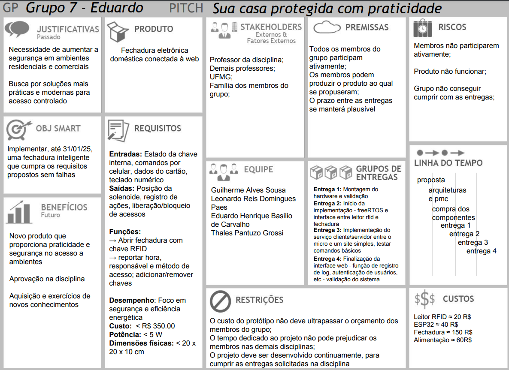
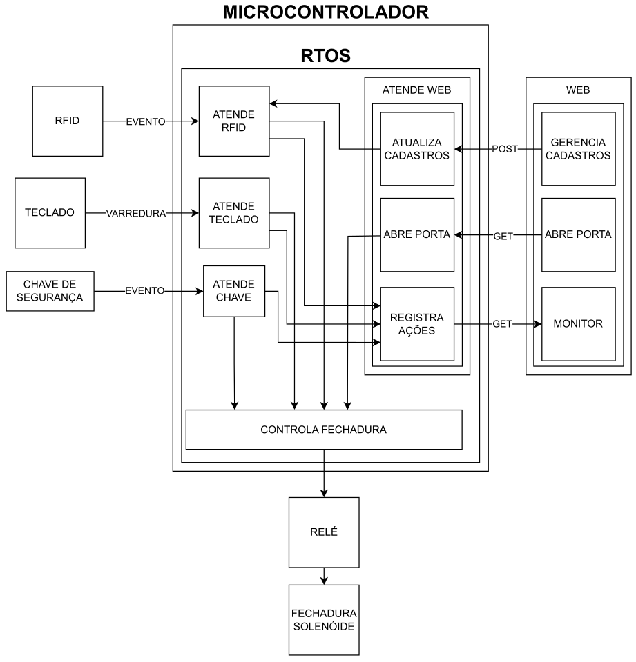
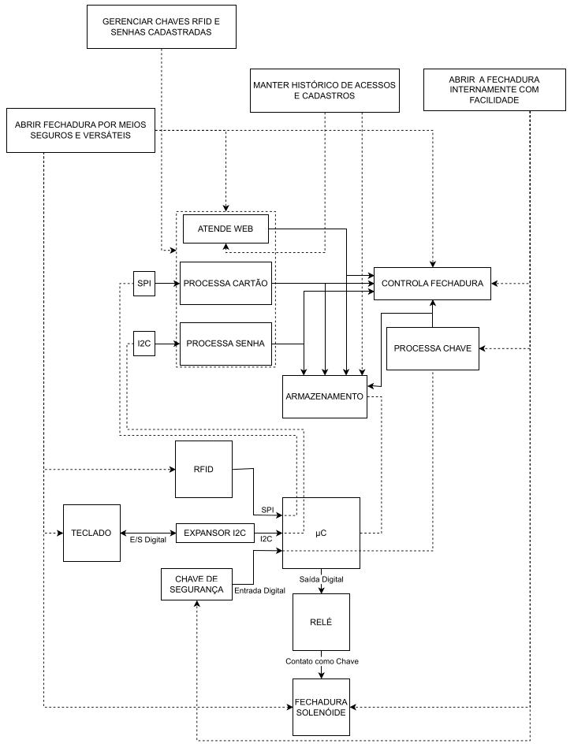

# Relatório do Projeto SmartLock

## Grupo 7

- Eduardo Henrique Basilio de Carvalho
- Guilherme Alves Sousa
- Leonardo Reis Domingues Paes

## Repositório
[Repositório no Github](https://github.com/eduardo-ufmg/EEE026_SisEmbutidos)

## Introdução

O presente relatório aborda o desenvolvimento do projeto SmartLock, cujo objetivo principal foi conceber e implementar um sistema de controle de acesso seguro e eficiente, eliminando a necessidade de chaves mecânicas. Para tal, o sistema foi concebido para integrar múltiplas modalidades de autenticação, incluindo RFID, senhas numéricas, controle remoto via interface web e acionamento interno por chave elétrica.

## Project Model Canvas

O planejamento estratégico do projeto foi delineado por meio da ferramenta Project Model Canvas, permitindo a visualização holística dos requisitos funcionais e não funcionais, dos recursos necessários e dos desafios inerentes ao desenvolvimento. A seguir, apresenta-se a representação gráfica do Project Model Canvas adotado:

## Arquitetura do Sistema

A concepção arquitetural do sistema foi pautada na modularidade e na interoperabilidade entre os subsistemas. A seguir, são apresentadas as arquiteturas geral, de software e de hardware, detalhando os principais aspectos técnicos e organizacionais.

### Arquitetura Geral

A arquitetura geral do SmartLock foi projetada de forma hierárquica e distribuída, integrando sensores, atuadores e interfaces de controle por meio de um microcontrolador central. O diagrama abaixo ilustra a estrutura de alto nível do sistema:

### Arquitetura de Software

A modelagem da arquitetura de software foi baseada na separação de responsabilidades, utilizando abordagens de programação concorrente e orientada a eventos para otimizar o desempenho e a escalabilidade do sistema.

### Arquitetura de Hardware

A arquitetura de hardware foi estruturada para garantir compatibilidade entre os componentes e eficiência na comunicação entre dispositivos. O diagrama abaixo apresenta a interconexão dos elementos físicos e virtuais empregados no projeto:

## Desenvolvimento

O processo de desenvolvimento contemplou a implementação de diversas funcionalidades fundamentais para a operação do SmartLock. No entanto, obstáculos técnicos e restrições temporais impediram a conclusão integral do escopo inicialmente previsto.

### Funcionalidades Implementadas

- Autenticação por RFID
- Autenticação por senha numérica via teclado
- Controle da fechadura por relé
- Registro e monitoramento local de acessos

### Funcionalidades Não Implementadas

- Interface web para gestão e monitoramento do sistema
- Implementação do gerenciamento remoto completo
- Integração com soluções avançadas de segurança

## Dificuldades Encontradas

- Dificuldades na organização e comunicação entre os membros da equipe
- Atraso no início do desenvolvimento

## Conclusão

Embora nem todas as funcionalidades tenham sido completamente implementadas, o projeto atingiu um nível operacional que permite a autenticação e acionamento da fechadura eletrônica por múltiplos meios alternativos às chaves convencionais. Trabalhos futuros podem concentrar-se na conclusão das funcionalidades pendentes e na otimização dos componentes existentes, elevando a robustez e a confiabilidade do sistema.
